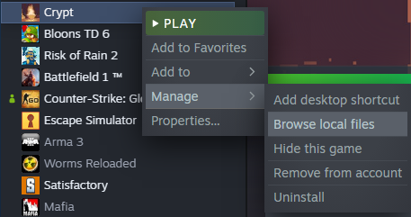
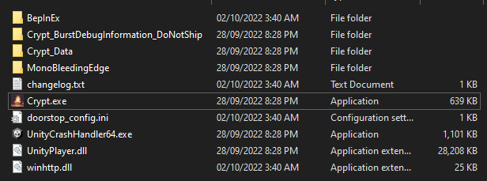
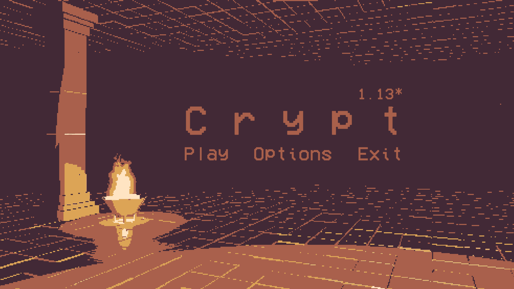

# Crypt Speedrunning Plugin

> Current Version: **0.0.1**

This project is a BepInEx plugin designed to be injected into Valefisk's psychological dating sim [Crypt](https://store.steampowered.com/app/2138700/Crypt/). The goal of this project is to provide a timer in-game to standardize timings for speedrunning hopefuls. Currently, the timer will start once the spawn door key is put into its respective lock. This *might* change in the future.

This has been a horrible waste of my time, and I wish you luck in yours.

## Installation Instructions

1. Download the appropriate zip folder for your OS in Releases.
2. Figure out where Crypt is installed on your PC. This is done by right-clicking Crypt in the Steam library, hovering over `Manage`, and then clicking `Browse Local Files`.

3. Extract the downloaded zip folder's contents into the folder. The folder should look like the following:

4. Open the game by opening `Crypt.exe` **directly** once to ensure that it's hooked. If done correctly, there should be an asterisk next to the version number as can be seen here:

If there isn't an asterisk, try re-opening the game again. If it still doesn't show up, contact me on Discord at `@gristCollector#8688`.

## Changelogs

**0.0.1** : Initial Release for testing

## Development Instructions

As you can probably see in the listings, there's 3 empty folders. 2 of them have been emptied as it's mostly just NuGet caching (`obj`), and release artifacts (`bin`). `lib`, however, contains DLL files from the game (located in `Crypt_Data`). These files are specifically `Assembly-CSharp.dll` (the actual game DLL), `Unity.TextMeshPro.dll` (for showing text in the UI), and `UnityEngine.UI.dll` (for having access to the UI). These are not distributed with this repository since I don't want to be sued (even though it's probably okay? I'd rather not risk it).

In order to develop, you will need to manually copy-paste these DLLs yourself into the `lib` directory to build the plugin. Once that is done, you will be able to freely change and modify the game as you please. There could be more work in the future for a proper modding library for this game, but quite frankly it's not worth the effort.
